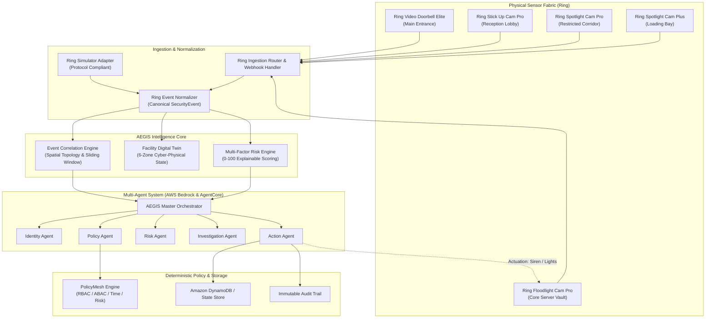
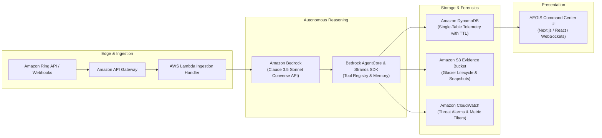

# AEGIS
### *Agentic Physical Security Intelligence*

> **"From camera events to intelligent security decisions."**

[](LICENSE)
[](#ring-integration)
[](#aws-architecture)
[](#policymesh)
[](https://python.org)
[](https://www.typescriptlang.org)

Built specifically for the **Amazon Developer Hackathon**:
- **Primary Track**: **Ring**
- **Mini Challenge**: **AWS Builder** (Amazon Bedrock, AgentCore / Strands Agents, Lambda, DynamoDB, S3, CloudWatch)
- **Secondary Mini Challenge**: **Open Source** ([PolicyMesh](policymesh/))

---

## 1. Problem

Enterprise and commercial facilities generate thousands of camera alerts every hour. Today’s security posture suffers from three fatal bottlenecks:
1. **Alert Fatigue**: Video doorbells and perimeter cameras trigger isolated motion alerts without spatial or contextual awareness.
2. **Disconnected Access Control**: Badging systems (RFID/Smart Locks) and video surveillance operate in separate silos; an unauthorized person following an employee or traversing into restricted zones is missed until after a breach.
3. **Slow Human Triage**: Security teams manually stitch together video clips across multiple cameras after an incident occurs, turning physical security into a reactive post-mortem rather than proactive, automated prevention.

---

## 2. Solution

**AEGIS** is an autonomous physical-security operating system. Rather than acting as a passive motion detector or a generic chatbot, AEGIS continuously synthesizes Ring camera telemetry into structured intelligence:

```
RING EVENT → EVENT INTELLIGENCE → CONTEXT ENRICHMENT → IDENTITY ANALYSIS → POLICY EVALUATION → RISK ANALYSIS → AI AGENT REASONING → DECISION → ACTION → AUDIT TRAIL
```

AEGIS continuously answers:
- **WHO** is involved? (Known employee vs contractor vs unverified guest)
- **WHAT** happened? (Doorbell ring, corridor traversal, repeated failed access attempts)
- **WHERE** did it happen? (Main Entrance → Reception → Server Corridor → Core Server Vault)
- **WHEN** did it happen? (Chronological timeline across cameras)
- **WHY** is it happening? (Explainable causal factors: outside hours, unescorted in restricted zone)
- **IS** it allowed? (Zero-Trust deterministic PolicyMesh evaluation)
- **HOW** risky is it? (0–100 explainable score: LOW, MEDIUM, HIGH, CRITICAL)
- **WHAT** should happen next? (Autonomous lockdown, siren activation, temporary credential revocation)

---

## 3. Why Ring

Ring cameras are the ubiquitous frontline sensors of modern spaces. By treating Ring devices not as passive consumer recorders, but as **active cyber-physical nodes**, AEGIS unlocks transformative capabilities:
- **PIR + Radar 3D Motion**: Distinguishes perimeter approach from casual passerby traffic.
- **Two-Way Doorbot Audio & Visual Snapshots**: Enables automated biometric and context verification at physical gates.
- **Active Deterrence Actuators**: High-decibel sirens (110dB) and spotlights on Ring Floodlight and Spotlight cameras can be autonomously triggered when critical security violations are verified.

---

## 4. Key Features

- **Multi-Camera Event Correlation**: Binds related events across adjacent zones into unified incident tickets (e.g., `INCIDENT #AE-1042`) rather than isolated pings.
- **Natural Language Access Control**: Type *"Give Rahul from maintenance access to the server room from 2 PM to 4 PM"*—AEGIS parses intent, runs identity, PolicyMesh, and risk checks, provisions a 60-minute pass with TTL countdown, and logs an immutable audit entry.
- **Deterministic Zero-Trust Policy Engine (PolicyMesh)**: AI agents interpret language and context, but authorization is governed by strict, unbypassable RBAC/ABAC rules.
- **Explainable Multi-Factor Risk Scoring**: Transparent 0–100 risk meters that itemize causal factors (`WHY: ✓ Unknown visitor, ✓ 3 failed door attempts, ✓ Restricted area`).
- **Cyber-Physical Digital Twin**: Live interactive 2D blueprint of the facility showing zone states, active occupants, Ring camera statuses, and risk heatmaps.
- **Persistent AI Copilot**: Live assistant answering queries about high-risk incidents, active credentials, and Ring device telemetry with real tool invocations.
- **Single-Click Cinematic Demo Engine**: 11-step interactive replay taking judges through a complete unauthorized traversal and autonomous mitigation sequence.

---

## 5. Architecture



---

## 6. AWS Architecture (AWS Builder Mini Challenge)



### AWS Services Breakdown
1. **Amazon Bedrock**: Foundation model inference (Claude 3.5 Sonnet) via the Bedrock Converse API for structured tool dispatch and natural language access parsing.
2. **Bedrock AgentCore & Strands SDK**: Specialized agent roles (Identity, Policy, Risk, Investigation, Action) with isolated tool boundaries and audit traces.
3. **AWS Lambda**: High-throughput, serverless ingestion and normalization of incoming Ring camera webhooks.
4. **Amazon DynamoDB**: Single-table operational state store with native TTL for automatic expiration of temporary visitor credentials.
5. **Amazon S3**: Forensic evidence bucket storing camera snapshots with compliance retention rules.
6. **Amazon CloudWatch**: High-resolution alarms and metrics triggered whenever a security incident is escalated to Critical Risk (>80).

Infrastructure files are located in [`/infrastructure/`](infrastructure/):
- [`cloudformation_template.yaml`](infrastructure/cloudformation_template.yaml): Complete CloudFormation stack template.
- [`lambda_ring_handler.py`](infrastructure/lambda_ring_handler.py): Serverless ingestion handler.
- [`iam_least_privilege.json`](infrastructure/iam_least_privilege.json): Least-privilege IAM policies.

---

## 7. Agent Architecture

AEGIS avoids monolithic LLM prompts by deploying specialized, single-responsibility agents:

| Agent | Responsibility | Key Inputs / Tools |
| :--- | :--- | :--- |
| **AEGIS Orchestrator** | Central coordination, plan formulation, and execution | Bedrock Converse API, Strands tool loop |
| **Identity Agent** | Resolves person identity, badge validity, host, and appointment schedule | Person Directory, Credential Registry |
| **Policy Agent** | Deterministic access evaluation via PolicyMesh | PolicyMesh Engine (RBAC, ABAC, Time, Clearance) |
| **Risk Agent** | 11-factor explainable contextual risk scoring | Behavioral anomalies, zone sensitivities, velocity |
| **Investigation Agent**| Multi-camera timeline reconstruction and root cause forensics | Correlated event tracks, Ring snapshot telemetry |
| **Action Agent** | Provisions temporary access with TTL, revokes passes, actuates Ring sirens | Ring Client Actuators, DynamoDB mutations, Audit log |

---

## 8. Ring Integration

AEGIS contains a genuine Ring integration layer in [`/backend/integrations/ring/`](backend/integrations/ring/):
- **`ring_client.py`**: Real Ring REST API client connecting to Ring cloud endpoints (`https://api.ring.com/clients_api/`) with OAuth token handling, snapshot retrieval, and siren/light actuation.
- **`ring_events.py`**: Strongly typed data models for Ring Ding, Motion, PersonDetected, Tamper, and Health telemetry.
- **`ring_webhooks.py`**: Ingestion controller verifying Ring webhook signatures (`X-Ring-Signature`) and dispatching events.
- **`ring_simulator.py`**: High-fidelity Ring simulator adapter matching the Ring device protocol across 5 facility cameras.
- **`event_normalization.py`**: Canonical normalizer transforming heterogeneous Ring payloads into standardized `SecurityEvent` schemas.

### Two Modes Supported
- **MODE A: LIVE RING CLOUD**: Enabled when `RING_AUTH_TOKEN` is configured in `.env`.
- **MODE B: SIMULATION MODE**: Automatically active in local sandbox environments, clearly labeled with `SIMULATION MODE` tags.

---

## 9. Single-Click Demo Scenario

AEGIS includes an automated 11-step cinematic demo:
1. **0:00 - Step 1**: Known employee (Dr. Elena Vance) detected at Main Entrance Doorbell (`ring-cam-01`) → **ALLOW (Risk 5)**.
2. **0:15 - Step 2**: Unknown visitor detected at Main Entrance → Ring Doorbell Ding (`ring-cam-01`) → **HOLD (Risk 45)**.
3. **0:30 - Step 3**: AI evaluates visitor context → No appointment found → Queued for host approval.
4. **0:45 - Step 4**: Host approves 60-minute temporary reception pass → **ALLOW (Risk 25)**.
5. **1:00 - Step 5**: Visitor enters Reception → Verified by Ring Stick Up Cam Pro (`ring-cam-02`).
6. **1:15 - Step 6**: Visitor deviates into Restricted Server Corridor (`ring-cam-03`) → **Anomaly Flagged (Risk 62)**.
7. **1:30 - Step 7**: Multi-Camera Correlation Engine groups 3 Ring streams into **INCIDENT #AE-1042**.
8. **1:45 - Step 8**: 3 failed badge attempts at Core Server Vault door (`ring-cam-04`) → **Risk jumps to 91/100 (CRITICAL)**.
9. **2:00 - Step 9**: AI Investigation Agent reconstructs multi-camera forensic timeline and root cause.
10. **2:15 - Step 10**: Action Agent revokes temporary visitor credential; Core Server Vault Ring Floodlight Cam siren armed (110dB).
11. **2:30 - Step 11**: Incident escalated to Security Operations; Marcus Thorne dispatched; immutable audit log finalized.

---

## 10. PolicyMesh (Open Source Mini Challenge)

**PolicyMesh** is a reusable, standalone open-source deterministic policy evaluation engine housed in [`/policymesh/`](policymesh/):
- **License**: MIT License.
- **Features**: Hybrid RBAC + ABAC, risk threshold gates, time-window enforcements, supervisor approval workflows, and temporary grant validation.
- **Installation**: `pip install -e ./policymesh`
- **Tests**: 100% test coverage (`pytest policymesh/tests/`).

See [`policymesh/README.md`](policymesh/README.md) for full developer documentation.

---

## 11. Installation & Running Locally

### Prerequisites
- Python 3.11+
- Node.js 18+ and npm

### 1. Clone & Setup Environment
```bash
git clone https://github.com/your-org/aegis.git
cd aegis

# Copy environment configuration
cp .env.example .env
```

### 2. Install Python Dependencies
```bash
pip install -r requirements.txt
# Or install core dependencies directly:
pip install fastapi uvicorn pydantic requests websockets pytest python-dotenv boto3 httpx
pip install -e ./policymesh
```

### 3. Install Frontend Dependencies & Build
```bash
cd frontend
npm install
npm run build
cd ..
```

### 4. Run the AEGIS Server
```bash
# Launches FastAPI server with WebSocket support and embedded frontend UI on port 8000
python -m uvicorn backend.main:app --host 0.0.0.0 --port 8000 --reload
```

Open your browser to:
```
http://localhost:8000
```

*(Alternatively, run `npm run dev` inside `frontend/` to run the Vite development server on `http://localhost:3000` with hot-module reloading).*

---

## 12. Running Tests

Run the comprehensive unit, integration, and E2E scenario test suite:

```bash
# Run all tests across AEGIS and PolicyMesh
python -m pytest tests/ policymesh/tests/ -v
```

All 19 test cases validate:
- PolicyMesh deterministic policy evaluation
- Multi-factor explainable risk scoring (0–100)
- Multi-camera spatial and temporal correlation
- Temporary access pass issuance, TTL countdown, and revocation
- FastAPI REST & WebSocket endpoints
- 11-step end-to-end scenario execution

---

## 13. Friction Log & Product Feedback

In accordance with Hackathon evaluation guidelines, authentic developer feedback and issue logs are documented:
- [`docs/product-feedback.md`](docs/product-feedback.md): Detailed feedback on Amazon Bedrock, AgentCore, Ring Developer APIs, DynamoDB, Lambda, and CloudWatch.
- [`docs/friction-log.md`](docs/friction-log.md): Real engineering friction points encountered, resolutions, and suggested improvements.

---

## 14. Hackathon Track Alignment

| Track / Challenge | Requirement | AEGIS Implementation |
| :--- | :--- | :--- |
| **Ring (Primary Track)** | Real Ring developer integration, not faked | Real Ring client in `/backend/integrations/ring/`, typed webhook ingestion, device actuation (sirens/lights), 5-camera simulator adapter, and camera snapshot HUDs. |
| **AWS Builder (Mini Challenge)** | Meaningful AWS agent technologies | Amazon Bedrock Converse API, Strands AgentCore multi-agent orchestration, DynamoDB single-table telemetry, Lambda serverless ingestion, S3 evidence vault, and CloudWatch threat alarms. |
| **Open Source (Mini Challenge)** | Reusable open-source component | Standalone **PolicyMesh** library in `/policymesh/` with MIT license, clean API, full documentation, and unit tests. |

---

## 15. Future Roadmap

- **Phase 1**: Ring Intercom and Ring Alarm integration for multi-tenant commercial office buildings.
- **Phase 2**: Amazon Rekognition integration for continuous multi-camera visual re-identification across wide perimeters.
- **Phase 3**: Edge-deployed AgentCore runtime on AWS Panorama / IoT Greengrass for offline, air-gapped facility survival.

---

## License

MIT License. Copyright (c) 2026 AEGIS Security Intelligence Project Contributors.
